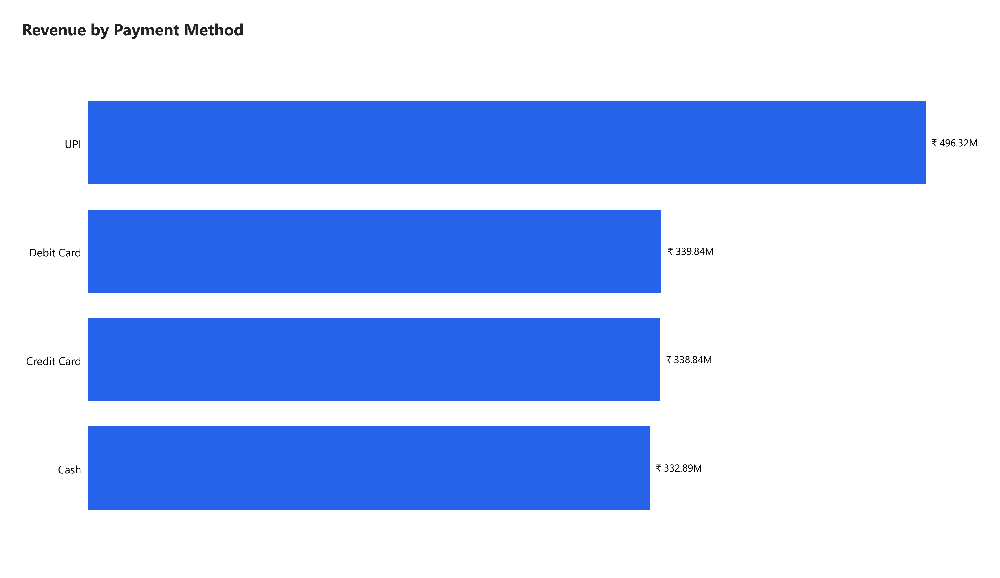
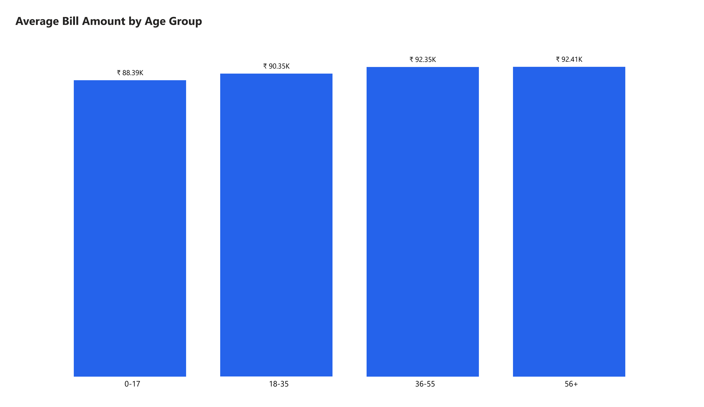
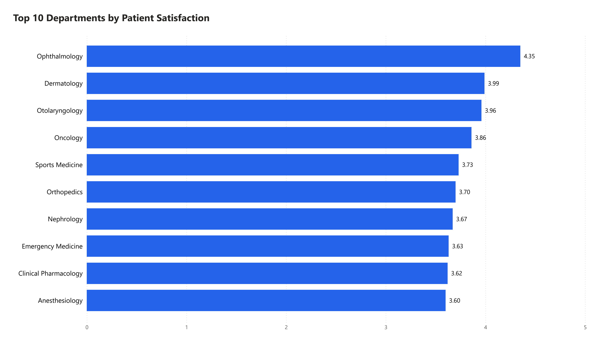

# Hospital Patient Visits Analysis (MySQL)

## Objective

Analyze synthetic hospital visit data from 2020–2025 to explore patient demographics, doctor workload, payment behavior, billing patterns, department performance, and service quality.

The project demonstrates an end-to-end SQL workflow, from relational database design and data loading to data cleaning, exploratory analysis, and business-focused insights.

## Dataset

A simulated hospital operations database covering 2020–2025. The dataset contains no real patient information.

| Table | Rows | Description |
|---|---:|---|
| `Dim_Patient` | 2,436 | Patient demographics |
| `Dim_Doctor` | 200 | Doctor roster |
| `Dim_Department` | 40 | Hospital departments |
| `Dim_Diagnosis` | 40 | Diagnosis codes |
| `Dim_Treatment` | 30 | Treatment/procedure codes |
| `Dim_PaymentMethod` | 4 | Payment method lookup |
| `PatientVisits` | 16,543 | Consolidated visit-level fact table containing dates, billing, insurance, satisfaction, and wait-time data |

## Analysis Process

### 1. Database & Schema Design
Created a relational database consisting of six dimension tables and four source visit tables covering 2020–2025.

### 2. Data Loading
Loaded the synthetic hospital dataset into MySQL.

### 3. Data Cleaning
Created cleaned dimension tables and a consolidated `PatientVisits` fact table.

Key cleaning steps included:

- Removed patient records with missing first names.
- Standardized patient names to proper case.
- Normalized gender values (`M`/`F` → `Male`/`Female`).
- Split the combined `CityStateCountry` field into separate `City`, `State`, and `Country` columns.
- Removed department records with missing categories.
- Standardized department names using the `Specialization` field.
- Combined four yearly visit tables into a single `PatientVisits` table containing 16,543 visits.

### 4. Exploratory Analysis

The analysis addresses questions including:

- How many distinct patients has each doctor treated?
- How is revenue distributed across payment methods?
- How does average bill amount vary across age groups?
- Which departments generate the most revenue and visits?
- How do departments rank within their categories by revenue?
- Which departments have the highest satisfaction and longest wait times?
- How do weekday and weekend visit volumes compare?
- How does hospital visit volume change over time?
- Which doctors have the highest average satisfaction scores among those with at least 100 visits?
- What treatments are most commonly associated with each diagnosis?
- Which diagnoses account for the highest visit volumes?
- What is the overall average wait time, satisfaction score, and bill amount?

## Key Findings

- **Doctor workload is relatively balanced.** Across 200 doctors, the number of distinct patients treated ranges from approximately 50 to 108. The highest-volume doctor, Dr. Vikram Singh, treated 108 distinct patients.

- **UPI is the dominant payment method.** UPI accounted for 5,404 of 16,543 visits (approximately 33%) and generated approximately ₹496M in revenue. Debit Card, Credit Card, and Cash were relatively close in both visit volume and revenue.

- **Average bill amounts are relatively consistent across age groups.** Average bills remain within approximately the ₹88K–92K range across the four age groups, suggesting that age alone does not show a strong association with bill amount in this dataset.

- **Overall service snapshot.** Across all 16,543 visits, the average wait time was approximately 56.5 minutes and the average patient satisfaction score was 3.62/5.

## SQL Techniques Used

- Relational database design
- Primary and foreign keys
- `JOIN`
- `GROUP BY`
- Aggregate functions (`SUM`, `AVG`, `COUNT`)
- `COUNT(DISTINCT)`
- `CASE` statements
- Common Table Expressions (CTEs)
- Window functions
- `RANK()`
- `HAVING`
- Date and time functions
- String manipulation and cleaning
- Data transformation

## Tools

**MySQL 8+**

## Project Structure

```text
hospital-patient-analytics/
│
├── README.md
│
└── sql/
    ├── 01_schema.sql
    ├── 02_data_load.sql
    ├── 03_data_cleaning.sql
    └── 04_exploratory_analysis.sql
```

## How to Run

Run the SQL files in the following order against a MySQL 8+ instance:

1. `sql/01_schema.sql` — creates the database tables.
2. `sql/02_data_load.sql` — loads the dataset.
3. `sql/03_data_cleaning.sql` — cleans and consolidates the data.
4. `sql/04_exploratory_analysis.sql` — runs the exploratory analysis.


## Visualizations


UPI generated the highest revenue among the four payment methods, accounting for approximately 33% of total visits.

<br>


Average bill amounts remained relatively consistent across age groups, ranging from approximately ₹88K to ₹92K.

<br>


The chart highlights the ten departments with the highest average patient satisfaction scores.

